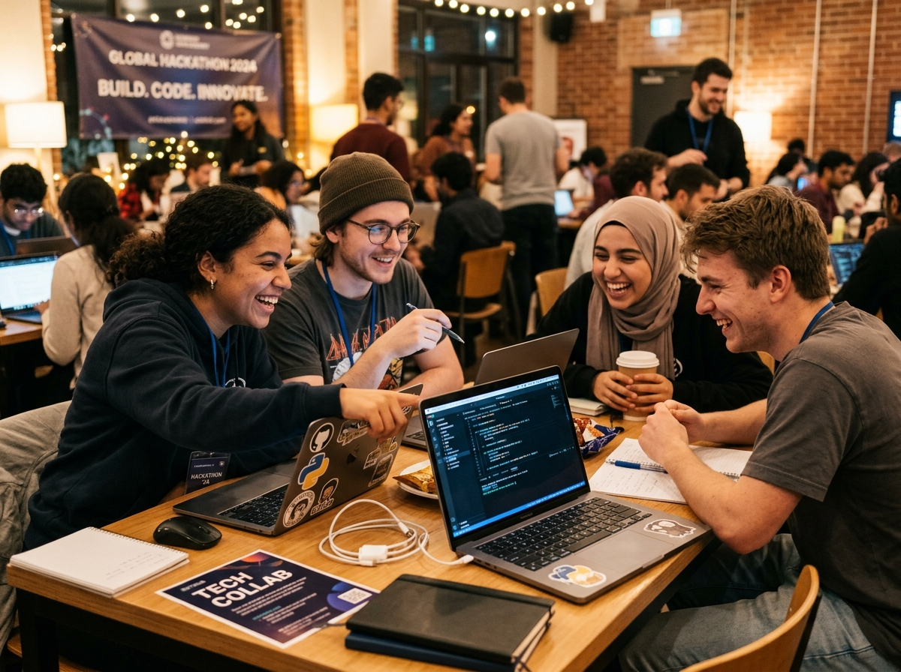

<div align="center">
  
  <h1 align="center" style="font-size: 2.6rem; font-weight: 800; letter-spacing: -0.02em; margin-bottom: 8px;">RiseTogether</h1>
  <p align="center" style="font-size: 1.15rem; color: #a3a3a3; max-width: 650px;">
    <strong>Learn. Build. Share. Grow.</strong><br>
    The next-generation collaborative developer ecosystem, open-source project matrix, and algorithmic problem arena.
  </p>

  <p align="center">
    <a href="https://www.djangoproject.com/"></a>
    <a href="https://www.django-rest-framework.org/"></a>
    <a href="https://react.dev/"></a>
    <a href="https://www.typescriptlang.org/"></a>
    <a href="https://vitejs.dev/"></a>
    <a href="https://tailwindcss.com/"></a>
  </p>

  <p align="center">
    
    
    
    
    
  </p>
</div>

---

## 🌟 Visual Showcase

<div align="center">
  <table>
    <tr>
      <td width="50%" align="center">
        <strong>🌐 3D Isometric Community Hub</strong><br><br>
        
        <br>
        <em>Interactive developer network, distributed sprint telemetry & live DSA activity matrix.</em>
      </td>
      <td width="50%" align="center">
        <strong>🤝 Collaborative Hacker Community</strong><br><br>
        
        <br>
        <em>40+ university chapters, weekly build sprints, and peer mentorship with zero gatekeeping.</em>
      </td>
    </tr>
  </table>
</div>

---

## 💡 What is RiseTogether?

**RiseTogether** is a full-stack developer community and social platform engineered with a strict **Domain-Driven Modular Monolith** architecture:

- **Frontend Tier**: Single Page Application built on **React 19**, **TypeScript 5.8**, and **Vite 8.3**. Features hardware-accelerated **Lenis inertial smooth scrolling**, pure jet black glassmorphic surfaces, and a strictly enforced brand color hierarchy.
- **Backend Tier**: **Django 5.2** and **Django REST Framework (DRF)** structured into encapsulated domain apps (`accounts`, `community`, `feed`, `riseapp`, `dsa`) with clear layering: **Models ➔ Serializers ➔ Services (Mutations) ➔ Selectors (Queries) ➔ API Views**.
- **User Experience**: Live interactive social feed with optimistic interactions, threaded discussions, open-source project showcases, technical blogs, gamified leaderboards, and an integrated DSA problem hub.

---

## 🏗️ System Architecture & Directory Topology

```
RiseTogether/
├── backend/                  # Django 5.2 + Django REST Framework
│   ├── config/               # Settings, root API routing, exception handlers
│   ├── common/               # Object permissions, pagination, and shared utilities
│   ├── accounts/             # Identity, session auth, profiles, activity scoring
│   ├── community/            # Blogs, showcases, activities, skills, categories
│   ├── feed/                 # Social timeline, likes, bookmarks, threaded comments
│   ├── riseapp/              # Public API, FAQs, testimonials, contacts, newsletter
│   ├── dsa/                  # Algorithmic challenges, code execution telemetry
│   └── manage.py             # Django CLI management executable
│
├── frontend/                 # React 19 + TypeScript + Vite Single Page Application
│   ├── src/
│   │   ├── api/              # Centralized Axios client with automatic CSRF
│   │   ├── components/
│   │   │   ├── ui/           # 24 reusable UI primitives (Button, Modal, Tabs...)
│   │   │   ├── layout/       # AppLayout, Navbar, Footer, Route guards
│   │   │   ├── community/    # ProjectCard, BlogCard, ActivityCard
│   │   │   ├── feed/         # PostCard, CommentSection, CreatePostModal
│   │   │   └── common/       # SmoothScroll (Lenis), ErrorBoundary, Toast
│   │   ├── context/          # AuthContext, ToastContext, LenisContext
│   │   ├── pages/            # Route views (Home, Feed, Blogs, Projects, Profile...)
│   │   ├── types/            # Strict TypeScript interfaces across all domains
│   │   └── index.css         # Jet black design system, Lenis rules, glassmorphism
│   ├── public/               # High-res logos, 3D community visuals, icons
│   └── package.json          # Vite + React 19 dependencies
│
├── docs/                     # 24 authoritative engineering specifications
│   ├── screenshots/          # High-resolution platform preview assets
│   └── README.md             # Documentation index and navigation matrix
│
├── scripts/                  # Cross-platform developer automation (dev & test)
│   ├── dev.ps1 / dev.sh      # Concurrent dev servers launcher
│   └── test.ps1 / test.sh    # Unified dual-tier test suite runner
│
├── AGENTS.md                 # Architectural principles & coding governance
└── CHANGELOG.md              # Historical release notes & migration records
```

---

## ⚡ Key Highlights & Capabilities

| Feature Domain | Capability Highlights |
|---|---|
| 🚀 **Hero Command Center** | Full-viewport dark aesthetic featuring 3D isometric community visuals, online telemetry, instant onboarding CTAs, and active sprint chips. |
| 🌊 **Deep Lenis Smooth Scroll** | Native-feeling momentum scrolling with custom damping (`lerp: 0.09`), sticky navbar anchor offset delegation, and zero-jitter layout. |
| 💬 **Rich Social Timeline** | Multi-media posts (image grids & video embeds), code snippet previews, optimistic likes, bookmarks, and threaded nested replies. |
| 🏆 **Gamified Leaderboards** | Real-time dynamic activity score calculation awarded for project contributions, technical tutorials, and algorithmic solutions. |
| 🧩 **4-Project Showcase Grid** | Responsive 2x2 grid displaying curated open-source projects with live GitHub and demo links, tech stack badges, and creator metadata. |
| 🔐 **Session & CSRF Security** | Django session-based authentication with `HttpOnly` and `SameSite=Lax` cookies, with automatic CSRF token negotiation on mutating requests. |
| 🎨 **Brand Color Hierarchy** | Strict design token enforcement: Brand Orange (`#f97316`) strictly reserved for Brand, Action, and Focus/Emphasis. All surfaces remain pure neutral dark. |

---

## 🚀 Quick Start Guide

### Prerequisites
- **Python 3.10+**
- **Node.js 18+** & **npm**

### Option A: One-Command Developer Runner (Recommended)

Launch both the Django backend (`127.0.0.1:8000`) and Vite dev server (`localhost:5173`) simultaneously:

```powershell
# Windows PowerShell
powershell -ExecutionPolicy Bypass -File scripts/dev.ps1

# Linux / macOS Bash
chmod +x scripts/dev.sh
./scripts/dev.sh
```

### Option B: Manual Setup

#### 1. Backend Setup
```bash
# Navigate to project root and create virtual environment
python -m venv .venv

# Activate virtual environment
# Windows:
.\.venv\Scripts\Activate.ps1
# Linux/macOS:
source .venv/bin/activate

# Install dependencies
pip install -r backend/requirements.txt

# Run migrations
python backend/manage.py migrate

# Start backend server (runs on http://127.0.0.1:8000)
python backend/manage.py runserver 127.0.0.1:8000
```

#### 2. Frontend Setup
```bash
# Navigate to frontend directory
cd frontend

# Install dependencies
npm install

# Start Vite dev server (runs on http://localhost:5173)
npm run dev
```

---

## 🧪 Automated Testing & Verification

RiseTogether maintains strict dual-tier test coverage:

```powershell
# Run complete test suite (both backend tests and frontend TypeScript build)
powershell -ExecutionPolicy Bypass -File scripts/test.ps1

# Or run backend test suite individually (28/28 tests passing)
python backend/manage.py test accounts community feed riseapp

# Or verify frontend TypeScript compilation
cd frontend && npm run build
```

---

## 📖 Comprehensive Engineering Documentation

Explore the complete authoritative guide suite located in the [`docs/`](docs/README.md) directory:

| Specification | Focus Area |
|---|---|
| [**Architecture Overview**](docs/ARCHITECTURE.md) | Multi-tier domain-driven modular monolith topology and request lifecycles |
| [**Frontend Architecture**](docs/FRONTEND_ARCHITECTURE.md) | React 19 SPA patterns, client-side routing, hooks, and state management |
| [**Backend Architecture**](docs/BACKEND_ARCHITECTURE.md) | Django 5.2 domain apps, services, selectors, and API views |
| [**Design System & Tokens**](docs/DESIGN_SYSTEM.md) | Pure jet black color tokens, typography (`Rajdhani` + `Inter`), and spacing |
| [**Component Library**](docs/COMPONENT_LIBRARY.md) | Catalog of 24 shared UI primitives with strict TypeScript interfaces |
| [**API Architecture & Conventions**](docs/API_ARCHITECTURE.md) | RESTful standards, error envelope normalization, and pagination |
| [**API Reference Guide**](docs/API_REFERENCE.md) | Full endpoint contracts, request payloads, and response structures |
| [**Authentication Guide**](docs/AUTHENTICATION.md) | Session auth, CSRF cookie exchange, login, register, and reset flows |
| [**Authorization & RBAC**](docs/AUTHORIZATION.md) | Server-side permission classes (`IsOwnerOrReadOnly`) and access controls |
| [**Data Model & Schema (ERD)**](docs/DATA_MODEL.md) | Database models, relational constraints, foreign keys, and indexes |
| [**Social Platform Mechanics**](docs/SOCIAL_PLATFORM.md) | Feed algorithms, optimistic state updates, threaded comment trees |
| [**Architecture Decisions (ADRs)**](docs/DECISIONS.md) | Record of architectural decisions (ADRs 001–005) |
| [**Testing Strategy**](docs/TESTING.md) | Backend unit/integration tests and frontend type-checking standards |
| [**Deployment Guide**](docs/DEPLOYMENT.md) | Production build generation, static collection, and hosting strategies |

---

## 🤝 Contributing & Governance

We welcome contributions from developers of all skill levels! Before contributing:
1. Please read our architectural rules in [`AGENTS.md`](AGENTS.md).
2. Follow the commit conventions outlined in [`docs/CONTRIBUTING.md`](docs/CONTRIBUTING.md).
3. Ensure all tests pass (`scripts/test.ps1`) before submitting a Pull Request.

---

<div align="center">
  <p>Built with ❤️ by the <strong>RiseTogether Community Core Team</strong>.</p>
  <p><sub>Licensed under the <a href="LICENSE">MIT License</a>.</sub></p>
</div>
