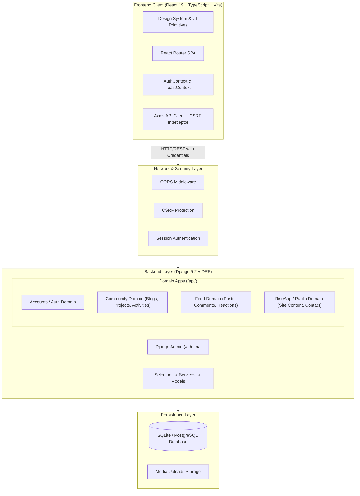

# System Architecture

RiseTogether is architected as a **Modular Monolith** pairing a **Django 5.2 & Django REST Framework** backend with a modern **React 19, TypeScript, and Vite** Single Page Application (SPA) frontend.

---

## 1. High-Level Architecture Diagram



---

## 2. Architectural Principles

1. **Clean Domain Separation**: Business logic is organized into distinct domain applications (`accounts`, `community`, `feed`, `riseapp`) without circular dependencies or tight internal coupling.
2. **Backend Authoritative**: All business logic, permission checks, activity scoring, and data validation are enforced server-side. The frontend acts purely as a presentation and interaction layer.
3. **Session & CSRF Security**: Authentication leverages robust Django sessions with `HttpOnly` session cookies and `SameSite=Lax` policies, coupled with CSRF token exchange for API mutations.
4. **Optimized Data Fetching**: Querysets employ `select_related` and `prefetch_related` to eliminate N+1 database queries across complex social and community relationships.
5. **Reusable Design System**: The frontend relies on centralized design tokens and strictly typed UI primitives to ensure visual consistency and prevent ad-hoc styling.

---

## 3. Directory Layout

```
RiseTogether/
├── backend/
│   ├── config/          # Django core configuration, settings, root URLs, exception handler
│   ├── common/          # Shared DRF permissions, pagination, and utilities
│   ├── accounts/        # User identity, profile management, and authentication APIs
│   ├── community/       # Blogs, projects, activities, categories, and skills
│   ├── feed/            # Social posts, rich media, comments, likes, and bookmarks
│   ├── riseapp/         # Public landing page content, FAQs, testimonials, contact, newsletter
│   ├── manage.py        # Django management CLI
│   └── requirements.txt # Python dependencies
│
├── frontend/
│   ├── src/
│   │   ├── api/         # Axios client and domain API endpoint modules
│   │   ├── components/  # Reusable UI primitives (ui/), layout shells (layout/), feature components
│   │   ├── context/     # AuthContext and ToastContext providers
│   │   ├── pages/       # Route-level page components
│   │   ├── types/       # Strict TypeScript interfaces and domain models
│   │   ├── router.tsx   # React Router route definitions
│   │   ├── index.css    # Design tokens and Tailwind CSS rules
│   │   └── main.tsx     # SPA entrypoint
│   ├── package.json     # Node dependencies and scripts
│   └── vite.config.ts   # Vite configuration and backend API proxy
│
├── docs/                # Comprehensive technical documentation
├── scripts/             # Cross-platform dev, test, and build automation
├── AGENTS.md            # Repository development and architectural governance rules
└── CHANGELOG.md         # Migration and development changelog
```
