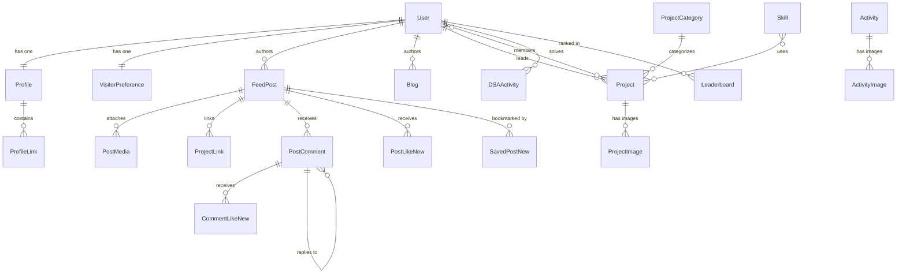

# Data Model & Entity Relationship

This document details the complete data schema, model definitions, foreign keys, and relationships across RiseTogether.

---

## 1. Entity Relationship Diagram (ERD)

---

## 2. Model Specifications by Domain

### Accounts Domain
- **`User`** (`accounts_user`): Custom user inheriting `AbstractUser` with unique `email`, `role` choices (`community_lead`, `deputy_lead`, `co_lead`, `member`, `visitor`), `USERNAME_FIELD = "email"`.
- **`Profile`** (`accounts_profile`): Extended profile storing `profile_pic`, `bio`, `posts_shared_count`, and dynamic `activity_score`.
- **`ProfileLink`** (`accounts_profilelink`): Social and portfolio links with `title` and `url`.
- **`VisitorPreference`** (`accounts_visitorpreference`): Notification and personalization toggles.

### Feed Domain
- **`FeedPost`** (`feed_feedpost`): Unified social timeline post supporting types (`normal`, `blog`, `project`), rich HTML or plain text content, `is_pinned`, `is_active`, and `views_count`.
- **`PostMedia`** (`feed_postmedia`): Multiple image and video file attachments per post with display ordering.
- **`ProjectLink`** (`feed_projectlink`): Live demo and repository URLs attached to project posts.
- **`PostComment`** (`feed_postcomment`): Threaded discussion comments supporting nested child replies via `parent = models.ForeignKey('self')`.
- **`PostLikeNew`** (`feed_postlikenew`): Unique `(post, user)` like toggles.
- **`CommentLikeNew`** (`feed_commentlikenew`): Unique `(comment, user)` like toggles.
- **`SavedPostNew`** (`feed_savedpostnew`): Unique `(post, user)` bookmarks.

### Community Domain
- **`Blog`** (`community_blog`): Articles with unique `slug`, `content` (HTML), `thumbnail`, `status` (`draft`, `published`), and `author`.
- **`Project`** (`community_project`): Showcase projects with `title`, `category`, `thumbnail`, `skills` M2M, `leader`, `members` M2M, `github_link`, and `live_link`.
- **`Activity`** (`community_activity`): Community sessions with `occurrence` (`once`, `weekly`, `monthly`), `date`, and `thumbnail`.
- **`DSAActivity`** (`community_dsaactivity`): Algorithm problem logs with `difficulty`, `complexity`, and `points_earned`.
- **`Leaderboard`** (`community_leaderboard`): Ranked standings across `daily`, `weekly`, `monthly`, and `all_time` periods.

### RiseApp Domain
- **`Contact`** (`riseapp_contact`): Public contact form submissions.
- **`Newsletter`** (`riseapp_newsletter`): Email subscribers with active status.
- **`Testimonial`** (`riseapp_testimonial`): Community reviews with star ratings (1–5) and author references.
- **`FAQ`** (`riseapp_faq`): Frequently asked questions with structured answers.
- **`SiteConfig`** (`riseapp_siteconfig`): Global counters for members, sessions, and projects.
