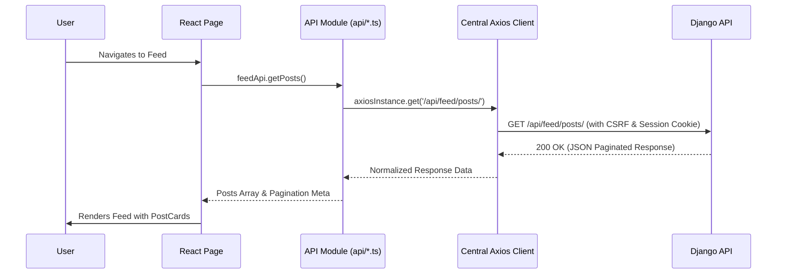

# Frontend Architecture

The RiseTogether frontend is built as a high-performance **Single Page Application (SPA)** using **React 19, TypeScript, Vite, React Router, and Tailwind CSS**.

---

## 1. Core Architecture Stack

- **Framework**: React 19 (`react`, `react-dom`)
- **Language**: TypeScript 5.8+ with strict typing (`noImplicitAny: true`)
- **Build Tool**: Vite 8.3 with Hot Module Replacement (HMR) and optimized Rollup bundling
- **Routing**: React Router 7 (`react-router-dom`)
- **HTTP Client**: Axios with automated CSRF cookie propagation and credential handling
- **Styling**: Tailwind CSS with custom design tokens, CSS variables, and glassmorphism utilities
- **Icons**: Lucide React (`lucide-react`) for UI icons and FontAwesome 6 for branded social icons

---

## 2. Component Hierarchy & Layering

```
Components Architecture
├── components/ui/       # Headless & Presentational UI Primitives (Button, Input, Modal, Avatar...)
├── components/layout/   # Shell components (Navbar, Footer, AppLayout)
├── components/feature/  # Domain-specific components (PostCard, BlogCard, CommentSection...)
└── pages/               # Top-level route pages (HomePage, FeedPage, ProfilePage...)
```

### Layer Responsibilities

1. **UI Primitives (`components/ui/`)**:
   - Agnostic to domain data and business logic.
   - Strictly typed props with semantic variants (`variant="primary"`, `size="md"`).
   - Fully accessible with keyboard navigation, focus rings, and ARIA attributes.
2. **Layout Shells (`components/layout/`)**:
   - Provide consistent headers, navigation bars, dropdowns, and footers across all views.
   - Adapt dynamically based on user authentication state.
3. **Domain Components (`components/community/`, `components/feed/`, `components/profile/`)**:
   - Receive domain types (`FeedPost`, `Blog`, `UserProfile`) and render domain-specific interactions.
   - Delegate actions (e.g. liking, commenting, opening edit dialogs) through callbacks or context.
4. **Route Pages (`pages/`)**:
   - Coordinate data fetching from API modules on mount or route transition.
   - Manage loading, error, empty, and success states using design system primitives.

---

## 3. Data Flow & API Integration



---

## 4. State Management Strategy

- **Server State**: Managed via scoped `useEffect` hooks in page components, fetched through domain API services (`authApi`, `communityApi`, `feedApi`, `siteApi`).
- **Global Auth State (`AuthContext`)**: Tracks the currently authenticated user profile, login status, and loading state. Synchronized on application boot via `/api/auth/me/`.
- **Global Feedback State (`ToastContext`)**: Dispatches transient notification banners (success, error, warning, info) with automatic timeout dismissal.
- **Local UI State**: Managed via `useState` / `useReducer` for modal toggles, dropdown active states, tabs, and form input values.
